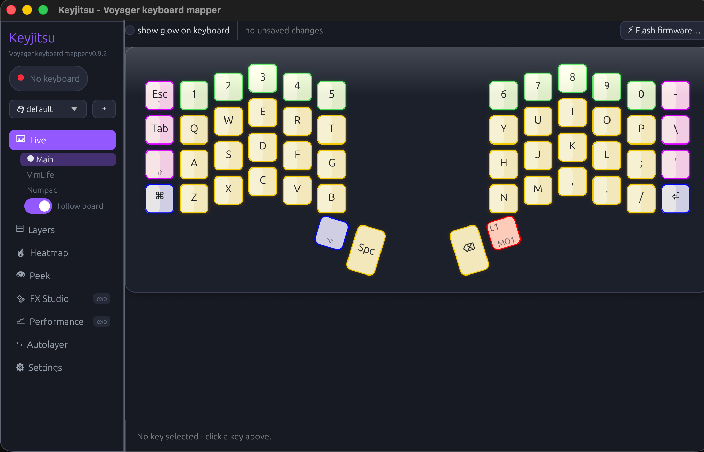

# Keyjitsu ⌨️🥋

[](https://github.com/martinezooo/keyjitsu/actions/workflows/ci.yml)
[](https://github.com/martinezooo/keyjitsu/releases)
[](LICENSE)



Voyager management, a local app. A GUI and CLI manager for the
[ZSA Voyager](https://www.zsa.io/voyager).

It aims for Keymapp feature parity and adds what Keymapp doesn't do: 100% local
firmware builds (with generated tap dances), per-key RGB and press effects, a
custom-effect sequencer, an app-aware autolayer, a Karabiner-style
built-in-keyboard guard, and a transparent layer minimap.

No daemon, no login, no cloud. Everything talks straight to the keyboard over
raw HID. The only network use is an anonymous read of your Oryx layout and a
check for a newer release (once at startup, can be turned off, plus on demand).
Nothing is downloaded or installed by itself.

> Quit Keymapp before running keyjitsu. The raw HID channel is exclusive.

## Status

**Beta.** Only tested on **macOS** with the **ZSA Voyager**. Other operating
systems and other ZSA boards are unsupported for now: the code is portable
Rust, but nothing else has been verified, so treat it as "may or may not
work". The config format can still change before 1.0.

## Screenshots

The **Live** editor: pick a key, set its keycode, glow color, and on-press effect.


The **Heatmap**: press counts across the board, with a ranking and CSV export.


The **Peek** overlay: a see-through minimap of the current layer that floats,
click-through, over whatever you are doing (here, a media and navigation layer).


## What's in the app

Run `keyjitsu` with no arguments for the windowed app. The left sidebar is the
menu, and the active tab expands its sub-items below it. Profiles sit at the
top: snapshot the whole setup under a name and switch between them without
losing anything.

- **Live.** Your layout with real Oryx legends, keys lighting up as you type.
  Click a key to edit its four slots (tap, hold, double tap, tap+hold), pick
  keycodes from an Oryx-style picker, set a per-key glow color and an on-press
  effect, then hit Build & flash. Firmware is compiled locally, and double-tap
  or tap+hold become generated QMK tap dances. Staged edits survive restarts
  (shown as pending) until you build.
- **Heatmap.** Per-layer or summed press counts, a ranking, and CSV export.
- **Peek.** A small, see-through overlay that shows the current layer's keys,
  so you can glance at what a layer does without leaving what you are doing. It
  appears when you switch layers (and can stay up the whole time you are on a
  non-base layer), floats click-through over everything; on macOS you can choose any monitor, and can
  be summoned by holding a key or chord on the Voyager.
- **FX Studio** (experimental). Build and test RGB effects: built-in constant
  and press effects, plus a step sequencer for your own (paint keys, duplicate
  a step, nudge it around the board, loop). Apply to the whole board, or per
  key from the editor's on-press slot. Board RGB survives restarts.
- **Performance** (experimental). keyjitsu samples its own CPU, tagged by what
  it was doing.
- **Autolayer.** Switch layers by the frontmost app, matched on the bundle id.
- **Settings.** Local QMK toolchain status and firmware build, the keyboard
  guard, start-at-login, the update check, and a shortcut library
  (a reference list of ~160 common shortcuts to borrow from, with your own
  entries and hideable built-ins).

The connection auto-reconnects on unplug, replug, and after flashing.

## Compared to Keymapp

ZSA gives you two separate tools: **[Oryx](https://configure.zsa.io)**, a website
where you design your layout and it builds the firmware in the cloud, and
**[Keymapp](https://blog.zsa.io/keymapp/)**, a desktop app that flashes that
firmware and shows a live layout reference. Keymapp itself does not edit or build,
that is Oryx's job. keyjitsu is one desktop app that edits, builds, flashes, and
shows your layout, all locally on macOS. This table compares the two desktop apps.

| Feature | Keymapp | keyjitsu |
| --- | :---: | :---: |
| Remap keys in the app | ❌ (only in Oryx, the website) | ✅ locally |
| Build firmware | ❌ (Oryx builds it in the cloud) | ✅ 100% local, no login |
| Flash firmware | ✅ (Oryx-built firmware, fetched from the cloud) | ✅ (its own local build) |
| Tap dances (double-tap, tap+hold) | ❌ (in Oryx) | ✅ generated locally |
| Per-key RGB | ❌ (in Oryx) | ✅ in the app |
| Custom RGB effect sequencer | ❌ | ✅ FX Studio |
| Heatmap | ✅ per layer | ✅ + summed, ranking, CSV |
| Live layer minimap | ✅ a plain always-on-top window | ✅ **Peek** |
| Minimap: transparent + click-through | ❌ (cannot be made see-through) | ✅ opacity slider, ignores the mouse |
| Minimap: position and triggers | drag the window | ✅ per-monitor anchor, shown on a key or chord, auto-hide, monochrome, combo and timing readout |
| ⭐ **Rest the Voyager on top of the MacBook keyboard** (built-in ignored, no ghost presses) | ❌ | ✅ guard + a self-test to confirm it, cannot lock you out |
| Autolayer (switch layers by app) | ❌ | ✅ |
| CLI / scripting | Zapp CLI + API | ✅ built-in CLI |
| Platforms | ✅ Windows, macOS, Linux | macOS primary; Windows/Linux hardening in progress |
| All ZSA boards | ✅ | Voyager only (tested) |
| Signed download + support | ✅ | ❌ beta, build from source |

## CLI

The CLI covers the core device, layout, heatmap, RGB, build and flash workflows. A few commands:

| Command | What it does |
| --- | --- |
| `keyjitsu list` | List connected ZSA keyboards |
| `keyjitsu status` | Connection, protocol/firmware version, active layer |
| `keyjitsu live` | Full-screen TUI live view (legends, heatmap overlay, layer browsing) |
| `keyjitsu layout` | Print every layer with legends (`--layer N`, `--json`, `--url`, `--refresh`) |
| `keyjitsu watch` | Stream key/layer events (`--json` for scripting) |
| `keyjitsu heatmap show/reset` | Render or clear collected stats |
| `keyjitsu layer set/unset N` | Switch layers from scripts |
| `keyjitsu rgb set/all/release` | Per-key or whole-board RGB |
| `keyjitsu build-local` | Compile firmware locally (`--set "L,POS=KC_X"`, `--dance "L,POS=TAP,HOLD,DOUBLE,TAPHOLD"`) |
| `keyjitsu flash <file\|url>` | Flash a `.bin` or an Oryx URL (`--latest` for the newest revision) |
| `keyjitsu guard` | Disable the built-in Mac keyboard while a ZSA board is connected (Ctrl+C restores) |

Add `--serial <substr>` to pick one of several keyboards.

## Local firmware builds

One-time setup (about 2 GB, plus an ARM GCC toolchain):

```sh
pipx install qmk
qmk setup zsa/qmk_firmware -b firmware25
```

Install the ARM GNU toolchain with your platform package manager or the official Arm distribution. Settings reports exactly which prerequisite is missing before enabling a local build.

Settings shows a green "Ready" pill once the toolchain is in place. A build
fetches your layout's generated source from Oryx once (cached, offline
afterwards), patches the keymap with your staged edits, generates any tap
dances, compiles with `qmk`, and flashes over the Voyager's bootloader. No ZSA
account needed.

Your edits live in that local firmware, not in Oryx. keyjitsu only reads your
base layout from Oryx (anonymously). A Keyjitsu-built firmware carries a compact
state id in the firmware serial, so after reconnect or app restart Live
reconstructs the exact Keyjitsu-authored state reported by the keyboard instead
of treating the last saved app config as device truth. It never writes back to
the portal. So remapping here does not carry over to Oryx, and re-flashing from
Oryx later would overwrite your Keyjitsu changes.

## How it works

- **Protocol.** ZSA's open Oryx raw-HID protocol v5 (32-byte reports, usage
  page `0xFF60`), as published in [zsa/qmk_modules](https://github.com/zsa/qmk_modules).
- **Layout state.** Stock Oryx firmware identifies itself as `hash/revision`.
  Keyjitsu-built firmware extends that identity with a local state id. The base
  revision is fetched from the Oryx GraphQL API and the exact Keyjitsu changes
  are reconstructed from the matching local firmware-state record.
- **Flashing.** Uses ZSA's own open-source [zapp](https://github.com/zsa/zapp)
  (`zapp-core`, MIT + Commons Clause) for the DFU/Ignition bootloaders and dual
  STM32+GD32 images. You press the reset button, then keyjitsu waits and flashes.
- **Guard.** Remaps the built-in keyboard's keys to no-ops with `hidutil` (no
  special permission needed). It can't lock you out: the built-in comes back
  around the lock screen and after any reboot, and is restored on toggle-off,
  disconnect, and quit. Engaged only while a ZSA keyboard is present.
  keyjitsu verifies with hidutil itself that the remap actually applied
  (rather than trusting a successful exit code), and Settings has a
  **"Test the guard"** button that listens system-wide for a moment to
  confirm no key press gets through. On some Macs, hidutil's remap reaches
  the keyboard's "Service" HID layer but not a separate raw "Device" layer
  that can still deliver key presses: run the test on your own Mac if you
  plan to rely on the guard, and don't treat it as absolute.
- **Storage.** State is kept in the platform data directory returned by the OS (`~/Library/Application Support/keyjitsu/` on macOS, the corresponding user data directory on Linux/Windows): `config.json`, `profiles/*.json`, `firmware-states/*.json`, heatmap stats, and cached layouts/sources.

## Install

### Release downloads

The release workflow builds:
- macOS Apple Silicon: `Keyjitsu.app` plus a CLI binary,
- Linux x86_64: a tarball containing the `keyjitsu` binary,
- Windows x86_64: a zip containing `keyjitsu.exe`.

Each release also includes `SHA256SUMS.txt`. Windows/Linux artifacts remain beta until their CI and smoke-test release gates are green.

On macOS the app is not notarized, so the first launch may require right-click -> Open or:

```sh
xattr -dr com.apple.quarantine /Applications/Keyjitsu.app
```

### Build from source

You need [Rust](https://rustup.rs). The QMK toolchain is only needed for local firmware builds.

```sh
cargo install --git https://github.com/martinezooo/keyjitsu
```

Run `keyjitsu` for the GUI or `keyjitsu list` for the CLI.

For the macOS app bundle:

```sh
git clone https://github.com/martinezooo/keyjitsu
cd keyjitsu
scripts/bundle.sh --install
```

A plain `cargo build --release` builds the desktop/CLI binary on supported desktop targets. Linux needs the normal hidapi/udev development packages at build time and udev access to the Voyager HID device at runtime.

macOS remains the primary hardware-tested target. Guard and Autolayer are macOS-only. Peek works on all desktop targets, but multi-monitor enumeration is currently macOS-specific; Windows/Linux use the current-display fallback until native monitor enumeration is validated.

## Privacy and network

keyjitsu has no accounts, no telemetry, and no background services. It talks
to exactly two places on the network, and both are easy to find in the source:

- `oryx.zsa.io`: an anonymous, read-only fetch of your layout (for the legends),
  cached on disk after the first time. Local firmware builds fetch the layout's
  generated source the same way, once. It never writes to Oryx.
- `api.github.com`: the latest release tag, once at startup (Settings can turn
  that off) and when you click Check for updates. Nothing is downloaded or
  installed by itself.

On macOS, the keyboard guard uses the system `hidutil` tool. Persistent files live in the platform user data directory selected by the `directories` crate; the app does not write system-wide state.

## Uninstall

Quit the app, then:

```sh
rm -rf /Applications/Keyjitsu.app
rm -f ~/Library/LaunchAgents/com.keyjitsu.gui.plist    # only if start-at-login was on
rm -rf ~/Library/Application\ Support/keyjitsu         # settings, profiles, caches
```

If the guard was on and the app was force-killed, a reboot restores the
built-in keyboard, and so does this command:

```sh
hidutil property --matching '{"Product":"Apple Internal Keyboard / Trackpad"}' --set '{"UserKeyMapping":[]}'
```

## Acknowledgements

Keyjitsu stands on open work from ZSA and the QMK community, and on the Rust
ecosystem. It does not reimplement what those projects already do well.

- **ZSA.** The Voyager itself, the open Oryx raw-HID protocol
  ([zsa/qmk_modules](https://github.com/zsa/qmk_modules)) that keyjitsu speaks,
  the public read-only Oryx layout API it reads anonymously, and the open-source
  [zapp](https://github.com/zsa/zapp) flasher (`zapp-core`), which keyjitsu links
  for the actual firmware flashing rather than rolling its own.
- **QMK.** Local builds use the standard [QMK](https://qmk.fm) toolchain and
  ZSA's `qmk_firmware` fork. The generated tap dances follow QMK's own idiom.
- **Rust crates.** [eframe / egui](https://github.com/emilk/egui) for the GUI,
  [ratatui](https://github.com/ratatui/ratatui) and crossterm for the TUI,
  [hidapi](https://crates.io/crates/hidapi) for USB HID, plus serde, ureq,
  clap, anyhow, zip, ctrlc, directories, and objc2 / core-foundation on macOS.
  See `Cargo.toml` for the full list and versions.

The protocol is implemented from ZSA's public spec, and layout data comes
through the public Oryx API. Keyjitsu is an independent project, not affiliated
with or endorsed by ZSA.

## License

MIT (see [LICENSE](LICENSE)). Firmware flashing links ZSA's `zapp-core`, which
is MIT + Commons Clause (no reselling its functionality), so keep that in mind
if you redistribute. The bundled symbol font is Noto Sans Symbols 2
(SIL OFL 1.1).
